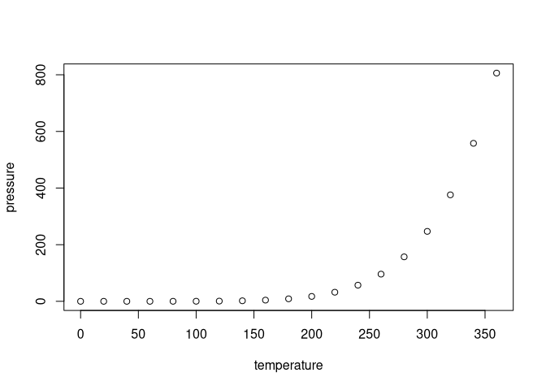

<!-- README.md is generated from README.Rmd. Please edit that file -->

# TextEvalR (WIP)

<!-- badges: start -->
<!-- badges: end -->

Implementation of text-evaluation metric BLEU [Papineni et al,
2002](https://aclanthology.org/P02-1040.pdf)

## Installation

You can install the development version of TextEvalR like so:

``` r
devtools::install_github("https://github.com/LazerLambda/TextEvalR")
```

## Example

Compute the BLEU-score on a sample from the (WMT 22 Metrics Shared
Task)\[<https://wmt-metrics-task.github.io/>\].

``` r
# library(TextEvalR)
# 
# ref <- list(c("The goods cost less than 20 euros.",
#               "The merchandise was less than 20 EURO."),
#             c("The fee would equal 40% of the value of the goods...",
#               "The fee corresponds with 40 % of the goods’ value..."),
#             c("I am #PRS_ORG# a serious customer and that is why it is not a problem for me.",
#               "I am a major client of #PRS_ORG# and thus it is no problem for me."))
# cand <- c("The goods cost less than 20 euros.",
#           "The fee corresponds to 40% of the value of the goods....",
#           "I'm a #PRS_ORG# major customer so it's not a problem for me.")
# bleu_c(ref, cand)
```

You’ll still need to render `README.Rmd` regularly, to keep `README.md`
up-to-date. `devtools::build_readme()` is handy for this. You could also
use GitHub Actions to re-render `README.Rmd` every time you push. An
example workflow can be found here:
<https://github.com/r-lib/actions/tree/v1/examples>.

You can also embed plots, for example:



In that case, don’t forget to commit and push the resulting figure
files, so they display on GitHub and CRAN.
